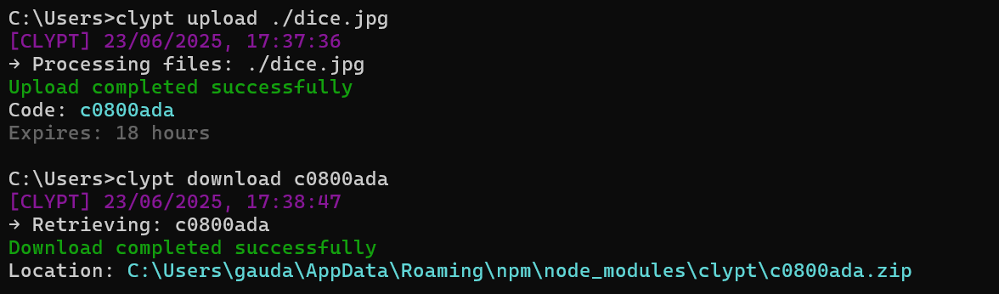

## Overview

Clypt is a secure file storage service that provides temporary file hosting with encryption. CLI tool enables user to upload and download files from the server.

### Clypt CLI features
- Multiple files upload support and retrieves unique access codes in a single command
- ZIP archive generation for downloads


### Clypt backend features
- Files are stored in encrypted form having expiry date and decrypted when client sent request with code 
- Supports multithreading to upload files concurrently
- Scheduled jobs to clean up file data from server and database


### System Flow
1. **Upload**: Files → Encryption → Storage → Unique Code Generation
2. **Download**: Code Validation → File Retrieval → Decryption → ZIP Creation
3. **Cleanup**: Scheduled job removes expired files at every interval


## Installation

Install Clypt globally using npm:

```bash
npm install -g clypt
```

## Usage

### Upload Files

Upload one or more files and receive a unique access code:

```bash
clypt upload <file1> <file2> <file3> ...
```

### Download Files

Download files using the unique access code:

```bash
clypt download <code>
```


### Example



